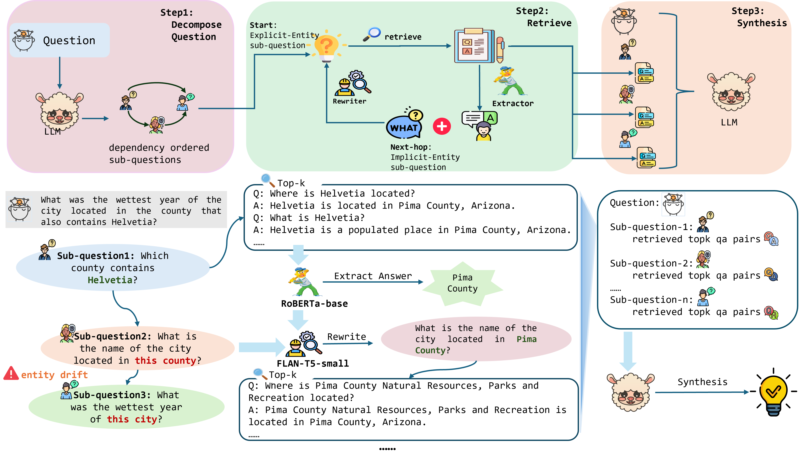

# CompactRAG

**Reducing LLM Calls and Token Overhead in Multi-Hop Question Answering**

[](https://www2026.thewebconf.org/)
[](https://opensource.org/licenses/MIT)
[](https://www.python.org/downloads/)

This is the official implementation of the paper **"CompactRAG: Reducing LLM Calls and Token Overhead in Multi-Hop Question Answering"**, accepted at **The Web Conference 2026 (WWW 2026)**.

## Overview

<p align="center">
  
</p>

Retrieval-Augmented Generation (RAG) has become the standard approach for knowledge-intensive NLP tasks. However, multi-hop question answering (MHQA) remains challenging as it requires integrating evidence from multiple documents. Existing iterative RAG pipelines face three critical issues:

1. **Efficiency degradation** as reasoning hops increase
2. **Redundant information** in retrieved context
3. **Entity drift** during multi-hop decomposition

**CompactRAG** addresses these challenges through a novel two-call framework that separates corpus processing from online inference:

- **Offline Stage**: An LLM reads the corpus once and constructs an **atomic QA knowledge base** — concise, fact-level QA pairs that reduce redundancy and better align with question semantics.

- **Online Stage**: A complex query is decomposed into dependency-ordered sub-questions. Each sub-question is resolved using lightweight modules:
  - **Answer Extractor** (RoBERTa-base): Extracts grounded entities from retrieved QA pairs
  - **Sub-Question Rewriter** (FLAN-T5-small): Resolves entity references to prevent semantic drift

The main LLM is invoked **only twice per query**: once for decomposition and once for final synthesis reasoning — making LLM usage **independent of hop depth**.

## Key Contributions

- **Scalability Analysis**: We analyze scalability issues in iterative RAG pipelines, showing how token consumption and LLM calls grow with reasoning depth.

- **Two-Call Framework**: We introduce CompactRAG, a two-call RAG framework that uses an offline atomic QA knowledge base and lightweight online modules to enable efficient multi-hop inference.

- **Comprehensive Evaluation**: We evaluate CompactRAG on HotpotQA, 2WikiMultiHopQA, and MuSiQue. Results show competitive accuracy and large reductions in inference token usage compared to strong iterative baselines.

## Installation

### Requirements

- Python 3.8+
- CUDA 12.x (for GPU acceleration)
- 24GB+ GPU memory (for vLLM inference)

### Setup

```bash
# Clone the repository
git clone https://github.com/your-username/CompactRAG.git
cd CompactRAG

# Create virtual environment (optional but recommended)
python -m venv venv
source venv/bin/activate

# Install dependencies
pip install -r requirements.txt
```

### Model Setup

Download the required models:

1. **LLM**: Meta-Llama-3-8B-Instruct (or your preferred model)
2. **Answer Extractor**: RoBERTa-base
3. **Question Rewriter**: FLAN-T5-small

Update the model path in `start_vllm_server.sh`:
```bash
MODEL_PATH="/path/to/your/Meta-Llama-3-8B-Instruct/"
```

## Usage

### Step 1: Start the vLLM Server

```bash
bash start_vllm_server.sh
```

This starts the vLLM OpenAI-compatible API server at `http://localhost:8000`.

### Step 2: Run Evaluation

#### Basic Usage

```bash
# Run on a single benchmark with default settings
python src/run.py --benchmark musique --method qa --model llama8b

# Run with specific parameters
python src/run.py --benchmark hotpotqa --method qa --topk 5 --model llama8b
```

#### Using the Run Script

```bash
# Run all benchmarks with all methods
./run.sh

# Run specific benchmarks and methods
./run.sh -b musique,2wiki -m qa --topk 5

# Run with parallel jobs
./run.sh -j 4 -b hotpotqa -m qa

# Specify output and log directories
./run.sh -o data/results -l logs
```

### Available Options

| Option | Description | Default |
|--------|-------------|---------|
| `-b, --benchmarks` | Comma-separated list of benchmarks | `hotpotqa,2wiki,musique` |
| `-m, --methods` | Comma-separated list of methods | `qa` |
| `--model` | Model name for inference | `llama8b` |
| `--topk` | Number of top-k QA pairs for retrieval | `5` |
| `--iterations` | Number of iterations for itergen method | `2` |
| `-j, --parallel-jobs` | Number of parallel jobs | `1` |
| `-o, --output-dir` | Output directory | `data/results` |
| `--log-dir` | Log directory | `logs` |

### Supported Benchmarks

- **HotpotQA**: Distractor setting with 10 Wikipedia paragraphs per question
- **2WikiMultiHopQA**: Multi-hop reasoning across Wikipedia articles
- **MuSiQue**: Answerable subset requiring multi-step reasoning

### Supported Methods

- `qa`: CompactRAG main method
- `itergen`: Iterative generation baseline
- `selfask`: Self-Ask baseline
- `ircot`: IRCoT baseline

## Training

### Train Answer Extractor

```bash
python train/train_roberta_qa.py
```

### Train Question Rewriter

```bash
python train/train_question_rewrite.py
```

### Generate Training Data

```bash
# Synthesize QA pairs for knowledge base
python train/SynthesisQA.py

# Synthesize question rewrite pairs
python train/SynthesisRewrite.py
```

## Project Structure

```
CompactRAG/
├── src/
│   ├── core/           # Core algorithms and methods
│   ├── metrics/        # Evaluation metrics (EM, F1, LLM-Acc)
│   ├── prompt/         # Prompt templates
│   ├── service/        # API service utilities
│   ├── utils/          # Helper functions
│   └── run.py          # Main entry point
├── train/              # Training scripts for lightweight modules
├── data/
│   ├── QA/             # Atomic QA knowledge base
│   ├── sampled/        # Sampled test data
│   └── results/        # Evaluation results
├── images/             # Framework figures
├── run.sh              # Batch evaluation script
├── start_vllm_server.sh # vLLM server startup script
└── requirements.txt    # Python dependencies
```

## Results

CompactRAG achieves competitive accuracy while significantly reducing computational overhead:

- **Only 2 LLM calls** per query (vs. 2n+1 for n-hop questions in iterative methods)
- **Reduced token consumption** through atomic QA retrieval
- **Consistent performance** across different hop depths

## Citation

If you find this work useful, please cite our paper:

```bibtex
@inproceedings{yang2026compactrag,
  title={CompactRAG: Reducing LLM Calls and Token Overhead in Multi-Hop Question Answering},
  author={Yang, Hao and Yang, Zhiyu and Zhang, Xupeng and Wei, Wei and Zhang, Yunjie and Yang, Lin},
  booktitle={Proceedings of the ACM Web Conference 2026 (WWW '26)},
  year={2026},
  publisher={ACM},
}
```

## License

This project is licensed under the MIT License - see the [LICENSE](LICENSE) file for details.

## Acknowledgments

We thank the authors of HotpotQA, 2WikiMultiHopQA, and MuSiQue for providing the benchmark datasets.
